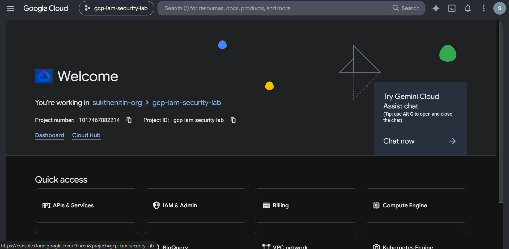
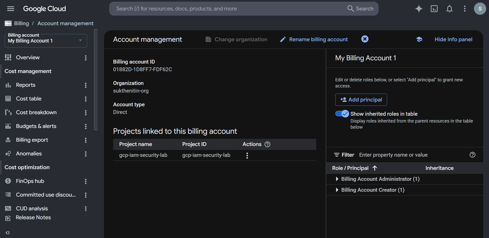
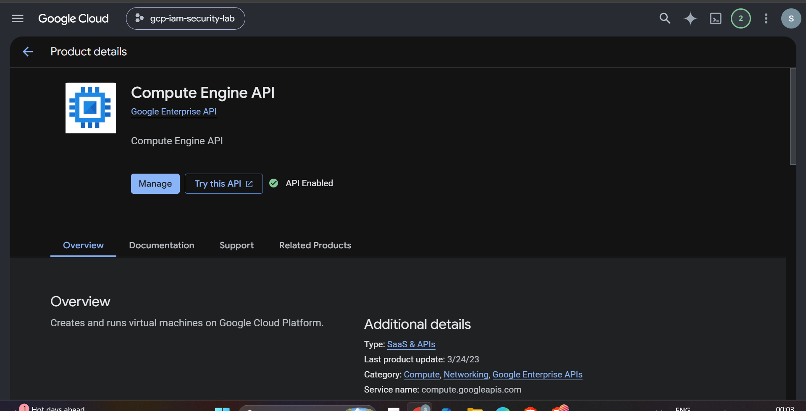
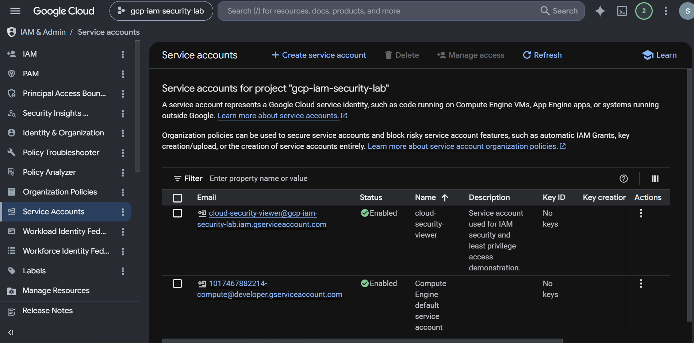
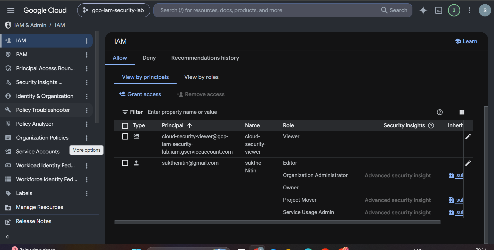
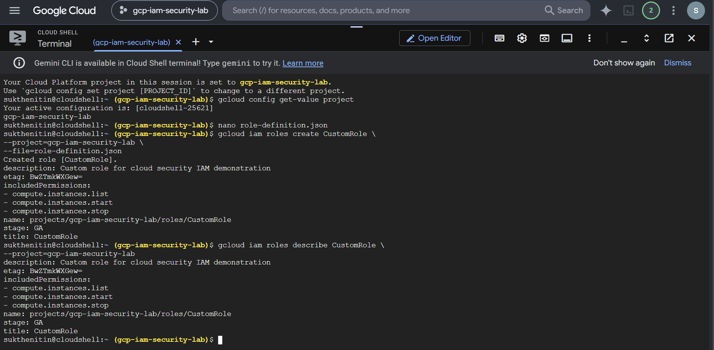
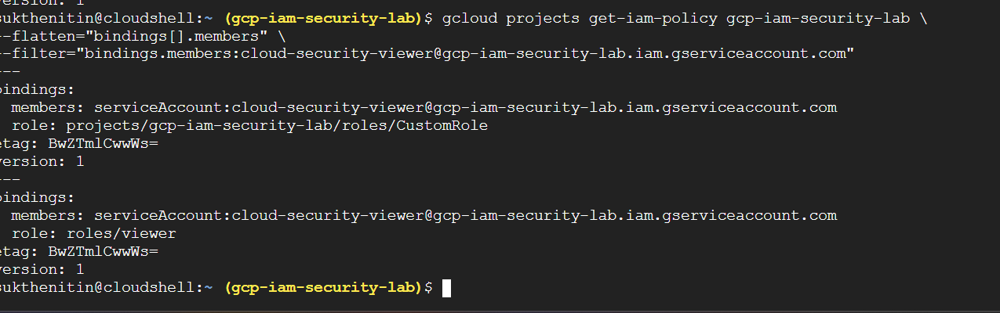
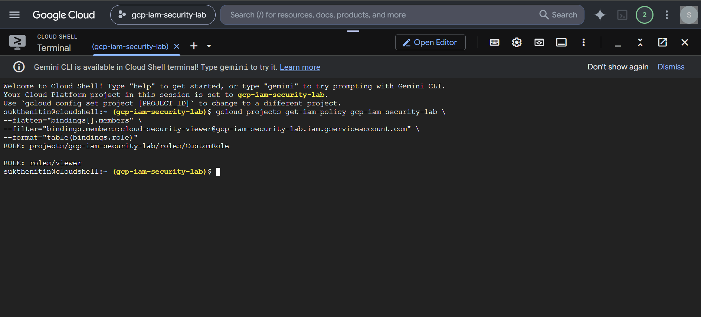
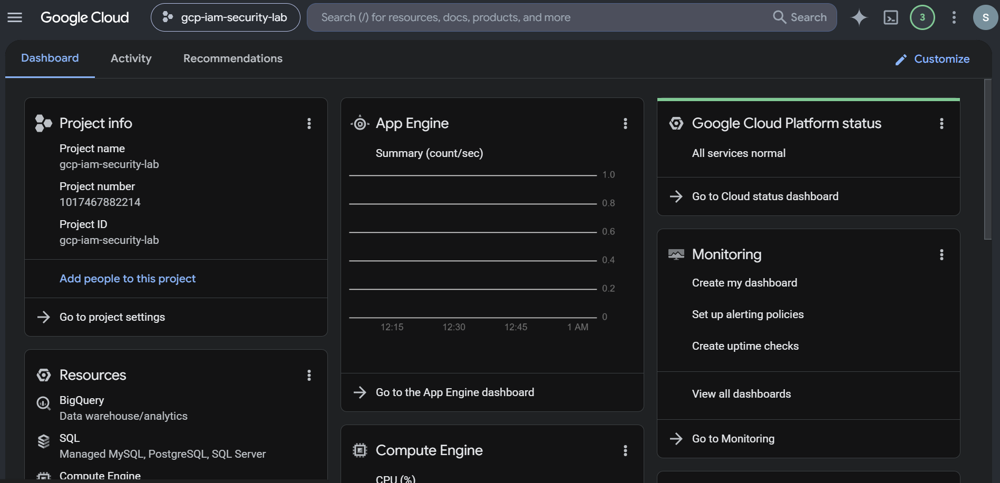

# GCP-IAM-Security-Lab
Configured and secured Google Cloud IAM using service accounts, custom roles, least-privilege access controls, and gcloud CLI automation.
# GCP IAM Security Lab

## Implementing Least-Privilege Access Control with Service Accounts and Custom IAM Roles in Google Cloud Platform


---

# Project Overview

This project demonstrates the implementation of secure Identity and Access Management (IAM) controls within Google Cloud Platform (GCP).

The objective was to design and implement a least-privilege access model using service accounts, predefined IAM roles, custom IAM roles, and policy verification through both the Google Cloud Console and gcloud CLI.

The project simulates real-world cloud security responsibilities performed by Cloud Security Engineers, including access management, privilege restriction, identity governance, and security automation.

---

# Key Security Objectives

* Configure Google Cloud IAM securely
* Implement Principle of Least Privilege (PoLP)
* Create and manage Service Accounts
* Assign IAM roles using Role-Based Access Control (RBAC)
* Develop custom IAM roles
* Verify access controls using gcloud CLI
* Demonstrate cloud governance best practices
* Document security implementation professionally

---

# Technologies Used

| Technology                  | Purpose                     |
| --------------------------- | --------------------------- |
| Google Cloud Platform (GCP) | Cloud Environment           |
| IAM & Admin                 | Access Control Management   |
| Service Accounts            | Identity Management         |
| Compute Engine API          | Cloud Resource Permissions  |
| Google Cloud Shell          | Cloud Administration        |
| gcloud CLI                  | IAM Automation              |
| JSON                        | Custom Role Definition      |
| Bash                        | Security Automation Scripts |

---

# Project Architecture

```text
User Account
      │
      ▼
IAM Policy
      │
      ▼
Service Account
      │
      ▼
Custom IAM Role
      │
      ▼
Compute Engine Permissions
```

This architecture follows cloud security best practices by enforcing controlled access through IAM policies and custom roles.

---


# Implementation Steps

## Phase 1 – Create GCP Project

A dedicated Google Cloud project was created to provide an isolated environment for IAM security configuration and testing.

### Evidence



---

## Phase 2 – Enable Billing and APIs

Billing was configured and the Compute Engine API was enabled.

### Security Benefit

Only required services were enabled, reducing the cloud attack surface.

### Evidence





---

## Phase 3 – Create Service Account

A dedicated service account was created.

### Service Account

```text
cloud-security-viewer
```

### Security Benefit

Provides workload identity while avoiding direct user permissions.

### Evidence



---

## Phase 4 – IAM Role Assignment

IAM permissions were assigned using Role-Based Access Control (RBAC).

### Assigned Roles

* Viewer
* Editor (Lab Demonstration)

### Evidence



---

## Phase 5 – Create Custom IAM Role

A custom IAM role was created using a JSON definition.

### Custom Permissions

```text
compute.instances.list
compute.instances.start
compute.instances.stop
```

### Evidence



---

## Phase 6 – Assign Custom Role

The custom role was assigned to the service account through IAM policy binding.

### Evidence



---

## Phase 7 – Verify IAM Policies

IAM policy bindings were verified using gcloud CLI.

### Verification Command

```bash
gcloud projects get-iam-policy gcp-iam-security-lab \
--flatten="bindings[].members" \
--filter="bindings.members:cloud-security-viewer@gcp-iam-security-lab.iam.gserviceaccount.com" \
--format="table(bindings.role)"
```

### Verification Results

Confirmed:

* Viewer Role
* Custom IAM Role

### Evidence



---

## Phase 8 – Project Completion

All configurations were validated and documented.

### Evidence



---

# Security Controls Implemented

## Principle of Least Privilege

Permissions were limited to only required actions.

## Role-Based Access Control

Access was controlled through IAM roles and policy bindings.

## Custom IAM Roles

Granular permissions replaced broad administrative privileges.

## Service Account Security

Dedicated service account used for identity management.

## Keyless Authentication

No service account keys were generated.

## Access Verification

IAM policies were validated through CLI inspection.

---

# Security Risks Mitigated

| Risk                  | Mitigation              |
| --------------------- | ----------------------- |
| Excessive Permissions | Custom IAM Role         |
| Unauthorized Changes  | Viewer Role             |
| Credential Exposure   | No Service Account Keys |
| Misconfigured Access  | IAM Verification        |
| Privilege Escalation  | Least Privilege Model   |

---

# Documentation

Detailed project documentation is available in the `docs/` directory.

| File                             | Description                    |
| -------------------------------- | ------------------------------ |
| Project-Overview.md              | Project summary                |
| IAM-Architecture.md              | Security architecture          |
| Service-Account-Configuration.md | Service account implementation |
| Custom-IAM-Role.md               | Custom role development        |
| IAM-Policy-Verification.md       | Validation process             |
| Security-Best-Practices.md       | Security recommendations       |
| Cleanup-Procedures.md            | Resource cleanup               |

---

# Automation Scripts

The `scripts/` folder contains reusable automation scripts.

| Script                | Purpose                |
| --------------------- | ---------------------- |
| create-custom-role.sh | Create custom IAM role |
| assign-custom-role.sh | Assign IAM permissions |
| verify-iam-policy.sh  | Verify IAM bindings    |
| cleanup.sh            | Remove lab resources   |

---

# Cloud Security Skills Demonstrated

* Google Cloud Security
* Identity and Access Management (IAM)
* Service Account Management
* Role-Based Access Control (RBAC)
* Principle of Least Privilege (PoLP)
* Cloud Governance
* Security Automation
* gcloud CLI Administration
* Access Control Validation
* Security Documentation

---

# Project Report

A detailed technical report is included:

```text
reports/GCP-IAM-Security-Lab-Report.pdf
```

---

# Author

**Nitin Sukthe**

Future Cloud Security Engineer

Focused on Cloud Security, IAM, Security Operations, and Defensive Security Engineering.
